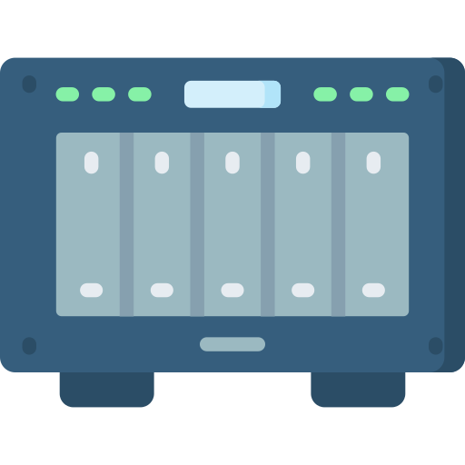

# TrueNAS System : Configure

## Table Of Contents

- [TrueNAS System : Configure](#truenas-system--configure)
  - [Table Of Contents](#table-of-contents)
  - [Fint It](#fint-it)
  - [Config TrueNAS General](#config-truenas-general)
  - [Config TrueNAS Network](#config-truenas-network)
  - [Next](#next)

## Fint It

You find your server with the address : truenas.local, so two way :

- **Ping it** : ping truenas.local
- **Go to it** : [TrueNAS Local](http://truenas.local)

## Config TrueNAS General

First of all, you have some config to do :

1) Check for update.
2) Change the root Password if you want (Admin account).
3) Go to **System Settings/General**
   1) Go to **GUI Settings**
      1) Change **HTTP** Port to **8000**.
      2) Change **HTTPS** Port to **8443**.
      3) Check **HTTP -> HTTPS Redirect** for better **security**.
      4) Uncheck **Crash reporting** and **Usage collection** if you want.
      5) Confirm and **reload** when UI has restarted !
   2) Go to **Localization Settings**
      1) Change the **language**.
      2) Change the **console Keyboard Map**.
      3) Change the **Timezone**.
      4) Change **Date** and **Time** Format.
4) Go to **Credentials/2FA** if you want to register some Two-Factor Authentification
   1) Change the size of your **one time password** (OTP) if you want.
   2) Change the **interval** if you want.
   3) Check enable **two-factor auth** for SSH.
   4) Click on Enable **Two-Factor Authentication**.
   5) Save the **Secret** in case of problem.
   6) Click on **Show QR** and setup on with your app on your **smartphone**.
   7) Click on **Save** and **try it** with a **disconnect** and **reconnect**.

## Config TrueNAS Network

With TrueNAS you need to configure two network interfaces, one for the internet connexion and another for the Bridge with VM to grant access to share folder from VM : [Documentation](https://www.truenas.com/docs/scale/virtualization/accessingnasfromvm/)

1) Go to **Network**
2) Go to **Global Configuration**
   1) Change the **hostname** if you want
   2) You can add some **DNS Server**
   3) Add the IPv4 Default Gateway (192.168.1.1 in most case)
3) Click on the first interface : **enpXsX** and uncheck DHCP and IPv6 and click on Apply
4) Add a new interface :
   1) Type : **Bridge**
   2) Name : **br0**
   3) In Bridge Members add **enpXsX**
   4) In IP Addresses add **192.168.1.X/24**
   5) Apply it
5) **Test Changes** and go with the new IPv4 Address to confirm it's works !

## Next

You can [configure your storage](./storage.md).
